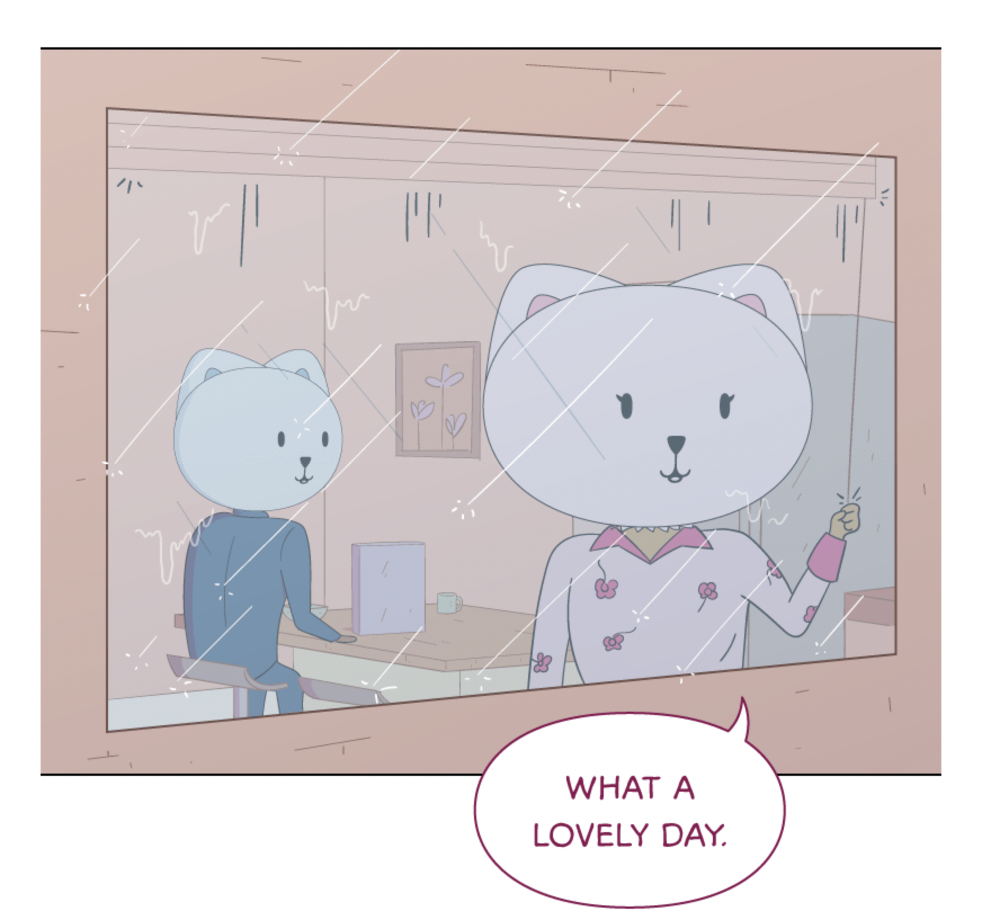
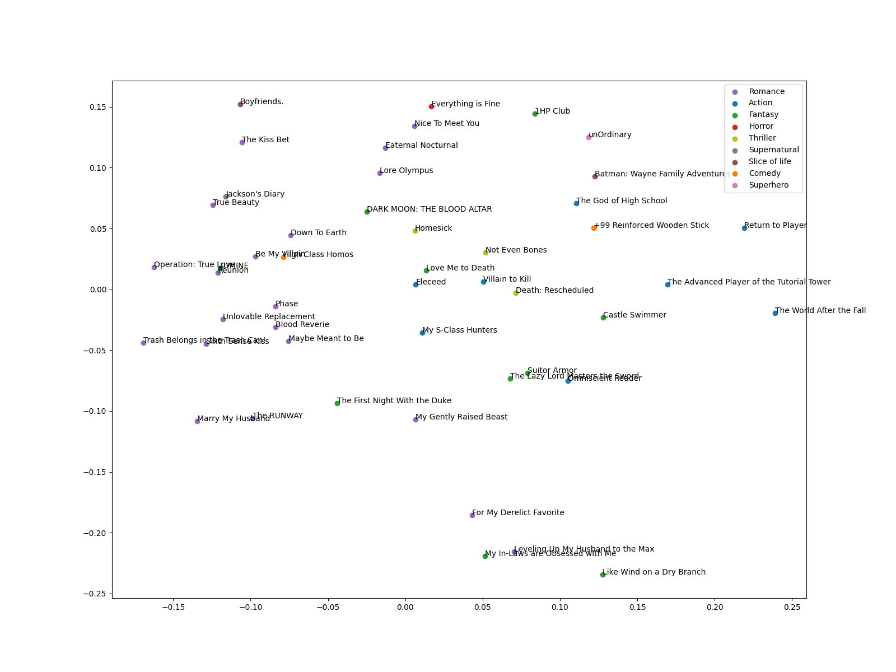

# Webtoon semantic analysis

I whipped this up over a weekend to test out [Cohere](https://docs.cohere.ai)'s platform and because I like webcomics. Plus I've read a *lot* of these webtoons so this is a neat exercise in convincing myself that LLMs actually work, even if they tend to do so in very high-dimensional and obscure ways.

## How it works

In this analysis, I scraped 48 popular webcomics off of the [Webtoons](https://www.webtoons.com/en/) platform with selenium-wire. Each webcomic had its first 10 episodes OCR'd into pure text with Tesseract, cleaned minimally, and then the cleaned text embedded in 1024 (small) or 4096 (large) dimensions with Cohere's API to form one embedding for each webcomic. I used scikit-learn and NumPy to run analyses, and matplotlib for plotting.

## Results

### Does it work?

Kind of... For such a visual medium, a surprising amount can be gleaned from just the text, which is the only thing the LLM can see. Generally, it's able to infer genre, at least, out-of-the-box & zero-shot. There's one noticeable exception: the horror webtoon [Everything is Fine](https://www.webtoons.com/en/horror/everything-is-fine/list?title_no=2578), which uses mostly visual irony and subtly strange conversation to achieve its effect, is horribly misclassified as... romance? (See its nearest neighbors with the small model [here](./recommendations.tsv); all four are romance.)

In case it's not clear, this is what I mean by visual irony:

(Panel from *Everything is Fine*.)

To be fair to the LLM, there are not many other horror webtoons, so it might've been forced to classify it with romance, but still... The misclassification appears to be significantly less egregious on the [large model](./recommendations_lg.tsv) than the [small model](./recommendations.tsv). In fact, the fourth-closest neighbor of *Everything is Fine* in the large model is the other horror comic *Homesick*, and only two of these four neighbors are romance. Scale is all you need?

If I were to optimize this analysis, I'd definitely use a multimodal method that incorporates the images as well. But for today I'm just interested in slapping an LLM on it and calling it a day.

### What does it _look_ like?

Here's the embeddings of each of the 48 webtoons reduced to two dimensions with PCA, colored by genre:

If I had to guess, the x-axis runs romance to action and the y-axis runs native English to translated English—many more translated Korean webcomics are at the bottom of this plot, as opposed to those originally in English, which tend to be at the top. I find it interesting both that the axes make some amount of coherent sense and that the geographic origin of webcomics seems so significant. Korean webcomics differ from American ones not only in that they are translated, so the English is often awkward, but tend to be quite different in tone and worldview.

### Which webcomics are more unique?

Now to answer the following pivotal question: are romance webtoons really all the same? Take a look at [originality_lg.tsv](./originality_lg.tsv), which scores each webcomic based off the average cosine distance to its five closest neighbors (including itself). Higher distance to neighbors implies that it is more "unique", in some sense. The most unique with this metric is *unOrdinary*, which makes sense as it's a pretty unique comic; the writing style and pace are both pretty unusual for a webtoon. Interestingly enough, almost all the ones I like and read have high uniqueness, so I guess I'm a novelty seeker. It's surprising that the LLM can glean this much from such a quickly spun up script on my side and I think it's really cool.

On the other hand, the least unique webtoons are pretty much all romance. So if you feel that romance webcomics are all the same, here's some definitive evidence for that.

### Can we make this into a recommendation engine?

Since clearly I only want to read webtoons similar to the ones I already like (this is sarcasm), we can make these embeddings into a recommendation engine via employing nearest neighbors. The recommendations generated can be found in [recommendations_lg.tsv](./recommendations_lg.tsv).  They're overall pretty good, I'd say; for example, *My Gently Raised Beast* is one of the recommendations for *Eleceed* and this is a pretty good pairing. On the other hand, the recommendations for *Everything is Fine* are not very good.

Generally, I'd say the recommendations made by the large model are better than the small model. There's less bizarre recommendations and more variety in the 1st recommendation (nearest neighbor).

### Thoughts on the Cohere API

It was very easy to use, which I really like. As promised, you can pretty much plug and play, and my queries are resolved really fast. On the other hand, it seemed a bit unwieldy to customize anything, or to ask the model to look for things in particular rather than just embedding (it would have been fun to try to ask it to rate quality, for example, although at that point I might just be pointing out general limitations of LLMs instead of Cohere's platform.) I could fine-tune it or something but then I need my own dataset; it'd be nice to have some built-in options. More might've been possible with a generative model, I suppose.
